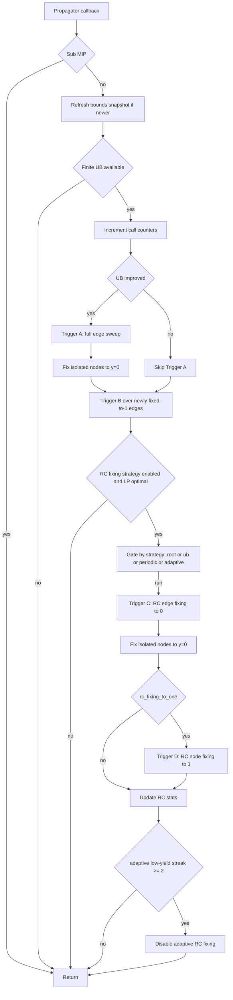

# Domain Propagator

Files: `src/preprocess/bound_propagator.h` (solver-independent), `src/model/highs_bridge.cpp` (HiGHS integration)

## Overview

Labeling-based domain propagation fixes variables when no improving tour/path can
use them under the current upper bound.

The solver implements four triggers inside propagation callbacks:

1. **Trigger A (UB sweep)**: when UB improves, scan all unfixed edges and fix
   those whose labeling lower bound exceeds UB.
2. **Trigger B (chained bounds)**: when an edge is fixed to 1, derive additional
   edge fixings from local or all-pairs bounds.
3. **Trigger C (RC fixing to 0)**: use LP reduced costs + resource-feasible
   labeling to fix edges to 0.
4. **Trigger D (RC fixing to 1)**: optional expensive pass that can fix nodes to 1.

## Components

1. **`BoundPropagator`** (solver-independent): reusable class in
   `src/preprocess/bound_propagator.h/.cpp`.
2. **HiGHS callback integration**: inlined hot-path implementation in
   `HiGHSBridge::install_propagator()` for low allocation overhead.

### BoundPropagator API

```cpp
#include "preprocess/bound_propagator.h"
#include "preprocess/edge_elimination.h"

auto fwd = rcspp::preprocess::forward_labeling(prob, prob.source());
auto bwd = rcspp::preprocess::backward_labeling(prob, prob.target());
double correction = prob.is_tour() ? prob.profits()[prob.source()] : 0.0;

rcspp::preprocess::BoundPropagator prop(prob, fwd, bwd, correction);

// Trigger A: sweep all edges when UB improves
auto fixed_edges = prop.sweep(upper_bound, col_upper);
auto fixed_nodes = prop.sweep_nodes(col_upper, /*y_offset=*/num_edges);

// Trigger B: chain fixings when edge is branched to 1
auto chained = prop.propagate_fixed_edge(edge, upper_bound, col_upper);

// Optional: all-pairs bounds for stronger Trigger B
prop.set_all_pairs_bounds(dist);  // flat n*n array
```

| Method | Returns | Description |
|---|---|---|
| `sweep(ub, col_upper)` | `vector<int32_t>` | Trigger A: edge indices fixable to 0 |
| `sweep_nodes(col_upper, y_offset)` | `vector<int32_t>` | Node variable indices fixable to 0 |
| `propagate_fixed_edge(e, ub, col_upper)` | `vector<int32_t>` | Trigger B: edge indices fixable to 0 after fixing edge `e=1` |
| `set_all_pairs_bounds(dist)` | void | Enables all-pairs Trigger B |

## Labeling Bounds

Computed by `src/preprocess/ng_labeling.h` and passed to propagator setup.

**ng-route / DSSR labeling** (`ng::compute_bounds`):
- Label-correcting algorithm with iterative ng-neighborhood growth
- Label state: $(\text{net\_cost},\ \text{demand},\ \text{predecessor},\ \text{ng-visited bitset})$
- Net cost = $\sum \text{edge\_costs} - \sum \text{profits}$ along path
- Capacity check: accumulated demand $\le Q$
- Dominance uses cost, demand, and visited-subset relation
- Optional SIMD prefilter (AVX2) for candidate scans with scalar fallback

When `dssr_async=true`, tighter snapshots may be published through
`SharedBoundsStore` during solve and consumed by the callback without restart.
This asynchronous update path is active only when `all_pairs_propagation=false`.

**Correction term**:
- Tour (`source == target`): `correction = profit(source)`
- s-t path (`source != target`): `correction = 0`

## Callback Flow



## Pseudocode

```text
on propagator_callback(domain, mipsolver, lp):
    if mipsolver.submip: return

    refresh bounds snapshot if shared store has newer version
    if bounds are unavailable: return

    ub <- min(mipsolver.upper_limit, async_upper_bound_if_any)
    if ub is +inf: return

    calls += 1
    ub_improved <- (ub < last_ub - 1e-9)

    if ub_improved:
        last_ub <- ub
        ub_improvements += 1
        clear processed_edge flags

        # Trigger A
        for each unfixed edge e=(u,v):
            lb <- min(f[u] + c[e] + b[v], f[v] + c[e] + b[u]) + correction
            if lb > ub + 1e-6: fix x_e upper bound to 0

        for each unfixed node i:
            if all incident edges fixed to 0: fix y_i upper bound to 0

    # Trigger B
    for each edge e fixed to 1 that is not yet processed:
        mark processed
        if all-pairs bounds available:
            scan all unfixed edges with 8 orientation formulas
        else:
            scan neighbors of both endpoints of e
        fix candidates with lb > ub + 1e-6

    if rc_fixing strategy is off: return
    if LP relaxation status is not optimal: return
    if strategy gate says "do not run": return

    # Trigger C
    derive RC edge costs and RC profits from lp.col_dual
    run RC labeling (fwd and bwd for path mode)
    compute z_LR
    for each unfixed/non-forced edge e:
        excess <- edge_lb_under_RC(e) - z_LR
        if z_LP + excess > ub + 1e-6: fix x_e upper bound to 0

    fix isolated non-endpoint nodes to y_i upper bound 0

    # Trigger D (optional)
    if rc_fixing_to_one:
        for each unfixed non-endpoint node i (parallel):
            run labeling with i forbidden
            if z_LP + (z_LR_minus_i - z_LR) > ub + 1e-6:
                fix y_i lower bound to 1

    update RC stats and timing
    if adaptive mode and two consecutive low-yield rounds (<5 fixings):
        disable adaptive RC fixing
```

## Trigger Details

### Trigger A: Upper-Bound Sweep

When the MIP upper bound improves (`ub < last_ub - 1e-9`):

1. Reset processed-edge flags.
2. For each unfixed edge $e=(u,v)$:
   - $\text{lb} = \min(f[u] + c_e + b[v],\ f[v] + c_e + b[u]) + \text{correction}$
   - If $\text{lb} > \text{ub} + 10^{-6}$: fix $x_e = 0$.
3. For each unfixed node variable $y_i$: if all incident edges are fixed to 0,
   fix $y_i=0$.

This is the dynamic analog of preprocessing edge elimination.

### Trigger B: Chained Bounds After `x_e = 1`

When an edge $x_{(a,i)}$ is fixed to 1 by branching or propagation:

### Default neighbor-only mode

- Forward through endpoint `i`:
  - $\text{cost}_{a\to i} = f[a] + c(a,i) - p(i)$
  - For each adjacent edge $(i,j)$:
    $\text{lb} = \text{cost}_{a\to i} + c(i,j) + b[j] + \text{correction}$
- Backward through endpoint `a`:
  - $\text{cost\_via\_i\_return} = c(a,i) + b[i] - p(a)$
  - For each adjacent edge $(k,a)$:
    $\text{lb} = f[k] + c(k,a) + \text{cost\_via\_i\_return} + \text{correction}$

Any candidate with $\text{lb} > \text{ub} + 10^{-6}$ is fixed to 0.

### All-pairs mode (`--all_pairs_propagation true`)

Scans all unfixed edges and evaluates 8 orientation/placement formulas
(fixed-edge direction, candidate-edge direction, before/after placement).

Disabled by default; useful mainly for selected instances.

### Trigger C: Lagrangian Reduced-Cost Fixing (edges to 0)

Uses LP reduced costs as labeling weights:

1. `rc_edge[e] = col_dual[e]`, `rc_profit[i] = -col_dual[m+i]`
2. Run RC labeling to get `rc_fwd`, `rc_bwd`
3. Compute `z_LR` (best RC-feasible tour/path)
4. For each eligible unfixed edge:
   - `excess(e) = edge_lb_RC(e) - z_LR`
   - If `z_LP + excess(e) > UB + 1e-6`: fix `x_e = 0`
5. Fix isolated non-endpoint nodes to `y_i = 0`

This is generally stronger than Trigger A because it adds LP dual information.

### Trigger D: Lagrangian Reduced-Cost Fixing (nodes to 1)

Optional (`--rc_fixing_to_one true`):

- For each unfixed non-endpoint node `i`, run labeling with `i` forbidden
  (`profit_i = -1e30`).
- Let `z_LR_minus_i` be best RC-feasible objective avoiding `i`.
- If `z_LP + (z_LR_minus_i - z_LR) > UB + 1e-6`, fix `y_i = 1`.

Requires one additional labeling run per candidate node (parallelized with TBB),
so it is disabled by default.

## HiGHS Integration Notes

### Patching

Requires two HiGHS patches:

- `HighsUserPropagator.h/.cpp`: callback API (`setCallback`, `clearCallback`, `propagate`)
- `HighsSearch.cpp`: call `HighsUserPropagator::propagate()` after
  `HighsRedcostFixing`

### Shared callback state

Captured as `shared_ptr` in the callback lambda:
- `last_ub`
- `processed_edge` bitmap
- Trigger counters (`propagator_calls`, `ub_improvements`, `sweep_fixings`, `chain_fixings`)
- RC counters (`rc_fix0_count`, `rc_fix1_count`, `rc_label_runs`, `rc_callback_runs`, `rc_time_seconds`)

### Sub-MIP guard

Callback returns immediately on `mipsolver.submip` because sub-MIPs have a
different column space.

### Logged statistics

At solve completion:

```text
Propagator: <calls> calls, <ub_improvements> UB improvements, <fixings> fixings (<sweep> sweep + <chain> chain)
RC fixing: <edge_fix0> edges fixed to 0, <node_fix1> nodes fixed to 1, <label_runs> labeling runs, <callback_runs> callback runs, <seconds>s
```

## CLI Options

| Flag | Default | Description |
|---|---|---|
| `--rc_fixing <strategy>` | `adaptive` | `off`, `root_only`, `on_ub_improvement`, `periodic`, `adaptive` |
| `--rc_fixing_interval N` | 100 | Interval for `periodic` |
| `--rc_fixing_to_one true` | false | Enable Trigger D |
| `--all_pairs_propagation true` | false | All-pairs Trigger B (and SPI in separation pipeline) |
| `--dssr_async true` | true | Background DSSR bound tightening during B&B |
| `--ng_initial_size N` | 4 | Initial ng neighborhood size |
| `--ng_max_size N` | 12 | Maximum ng neighborhood size |
| `--ng_dssr_iters N` | 6 | DSSR iterations per labeling run |
| `--ng_label_budget N` | 50 | Max active labels per node |
| `--ng_simd true` | true | Enable AVX2 prefilter path |

## Preprocessing Pipeline

The propagator reuses bounds from `Model::solve()` preprocessing:

```text
tbb::task_group
|- ng::compute_bounds(problem, source, target, opts) -> fwd_bounds, bwd_bounds
`- build_initial_solution(problem, budget)          -> initial solution
```

Bounds are used for:

1. Static edge elimination in `build_formulation()`
2. Dynamic propagation during branch-and-bound

With async DSSR enabled (and all-pairs disabled), background stages publish
improved snapshots consumed by the same Trigger A/B logic.

`adaptive` RC fixing runs only on UB-improvement events and self-disables after
2 consecutive low-yield RC rounds (each yielding fewer than 5 fixings).

## Testing

BoundPropagator unit coverage is in `tests/test_oracle.cpp` (`[propagator]`):

| Test | Description |
|---|---|
| Sweep fixes expensive edges | Trigger A eliminates high-cost edge under tight UB |
| Sweep with loose UB | No fixings under large UB |
| Sweep skips already-fixed edges | Pre-fixed edges are not returned |
| Sweep on s-t path problem | Path-mode Trigger A behavior |
| sweep_nodes fixes isolated nodes | Nodes with all incident edges fixed to 0 |
| sweep_nodes no fixings when edges open | No node fixings while incident edges remain open |
| propagate_fixed_edge (neighbor-only) | Trigger B neighbor-mode fixings |
| propagate_fixed_edge (all-pairs) | Trigger B all-pairs fixings |
| propagate_fixed_edge loose UB | No chained fixings under loose UB |
| has_all_pairs_bounds initially false | Default all-pairs state |
| Accessor correctness | `fwd_bounds`, `bwd_bounds`, `correction` accessors |

Integration/regression coverage is in `tests/test_propagator.cpp`
(`Propagator ...` and `All-pairs ...` test cases).

```bash
./build/rcspp_tests "[propagator]"
```
