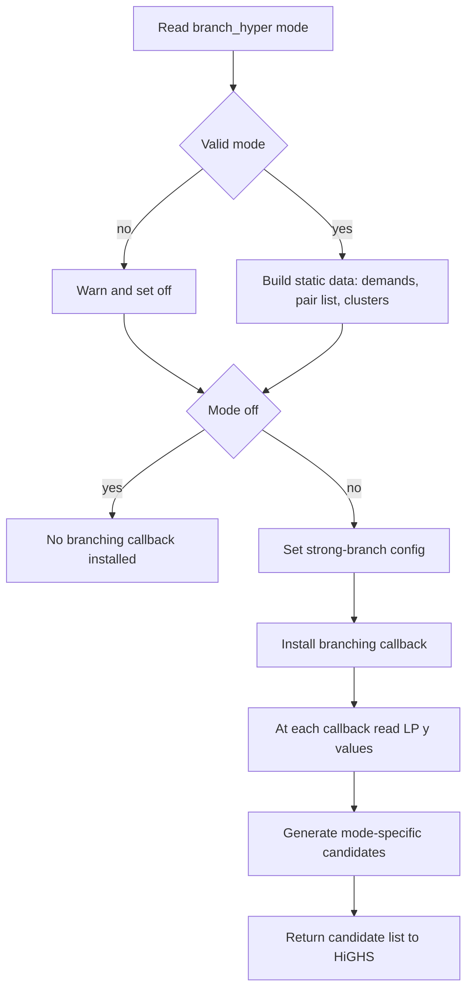

# Hyperplane Branching

File: `src/model/model.cpp`

## Overview

Optional hyperplane branching is enabled with `--branch_hyper <mode>`. The
callback proposes linear forms over node variables `y_i` as candidate
branching hyperplanes.

Mode values:

- `off` (default)
- `pairs`
- `clusters`
- `demand`
- `cardinality`
- `all`

If an unknown mode is passed, the solver logs a warning and falls back to `off`.

## Candidate Families

### `pairs`

Builds Ryan-Foster style 2-variable candidates:

- Precompute nearest-neighbor pairs `(i,j)` for non-depot nodes.
- Deduplicate using ordered `(min(i,j), max(i,j))` pairs.
- In callback, emit `y_i + y_j` only if both LP values are fractional
  (`0.05 < y < 0.95`).

### `clusters`

Builds small demand-weighted cluster hyperplanes:

- Seed clusters by descending demand.
- Grow each cluster greedily with nearest unassigned neighbors up to size 4.
- Emit `sum_{i in C} demand_i * y_i` only when the LP weighted sum is
  fractional (`frac in (0.01, 0.99)`).

### `demand`

Global demand hyperplane over non-depot nodes:

- `sum demand_i * y_i`

### `cardinality`

Global count hyperplane over non-depot nodes:

- `sum y_i`

### `all`

Returns the union of `pairs`, `clusters`, `demand`, and `cardinality`
candidates.

## Strong-Branch Tuning

Used when hyperplane branching is active:

| Option | Default | Meaning |
|---|---:|---|
| `branch_hyper_sb_max_depth` | `0` | Max B&B depth for hyperplane strong-branch probing |
| `branch_hyper_sb_iter_limit` | `100` | LP iteration cap per strong-branch trial |
| `branch_hyper_sb_min_reliable` | `4` | Pseudocost reliability threshold |
| `branch_hyper_sb_max_candidates` | `3` | Max hyperplane candidates tested with strong branching |

Input normalization in `Model::solve()`:

- `branch_hyper_sb_max_depth` is clamped to `>= 0`
- `branch_hyper_sb_iter_limit`, `branch_hyper_sb_min_reliable`, and
  `branch_hyper_sb_max_candidates` are clamped to `>= 1`

## Flow



## Pseudocode

```text
if branch_hyper not in {off,pairs,clusters,demand,cardinality,all}:
    warn
    branch_hyper <- off

if branch_hyper != off:
    build demands[]
    precompute rf_pairs if mode includes pairs
    precompute clusters if mode includes clusters
    configure strong-branch parameters

    set branching_callback(lp_solution):
        candidates <- []
        if mode includes pairs:
            add fractional y_i + y_j candidates from rf_pairs
        if mode includes clusters:
            add demand-weighted cluster candidates with fractional weighted sum
        if mode includes demand:
            add global demand candidate
        if mode includes cardinality:
            add global cardinality candidate
        return candidates
```

## Usage

```bash
./build/rcspp-solve instance.sppcc \
  --branch_hyper all \
  --branch_hyper_sb_max_depth 5 \
  --branch_hyper_sb_iter_limit 200 \
  --branch_hyper_sb_min_reliable 6 \
  --branch_hyper_sb_max_candidates 4
```
