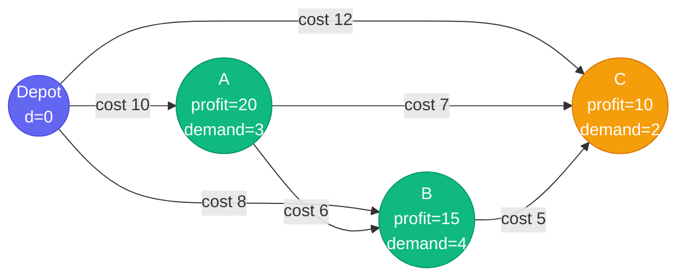
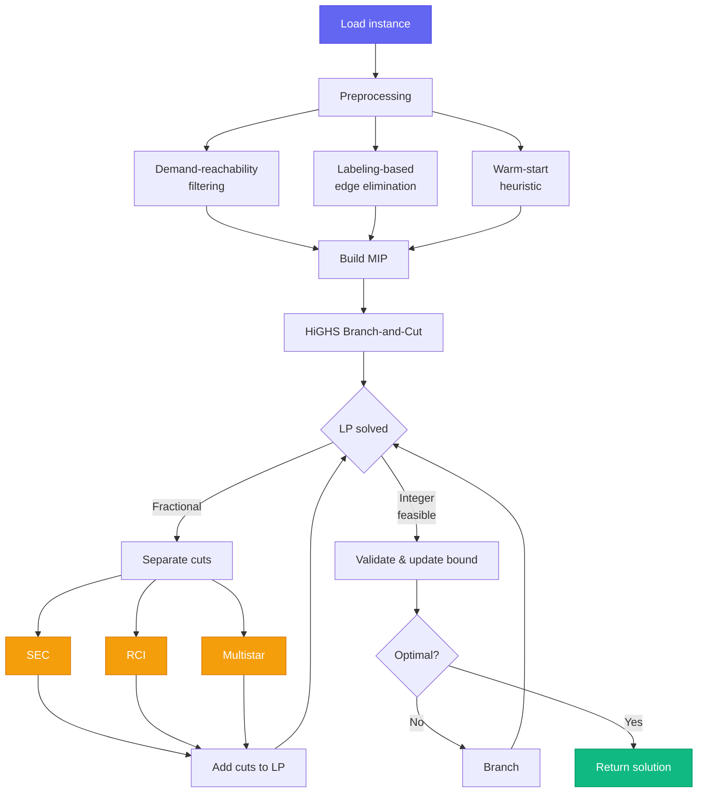
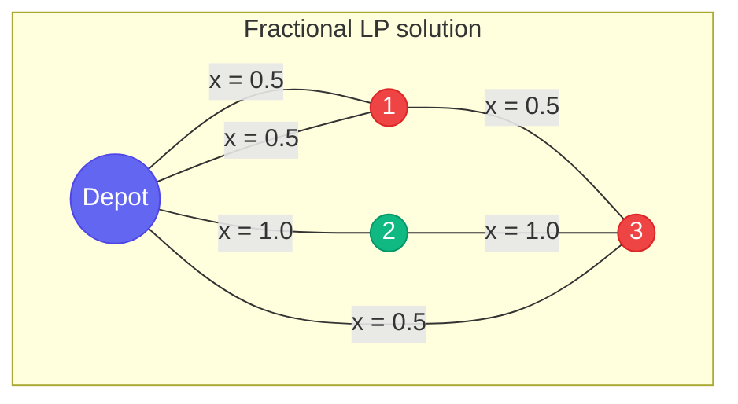
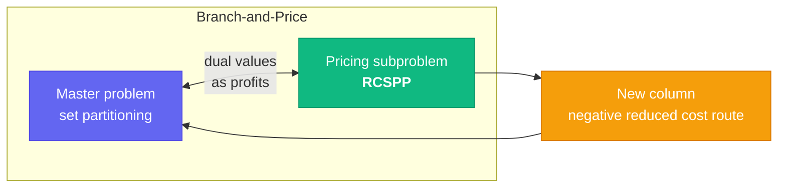
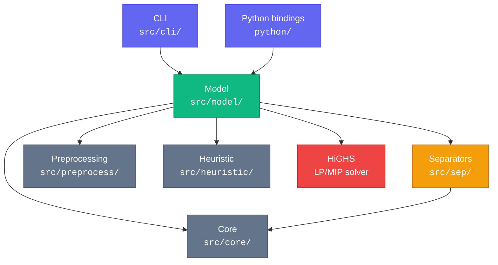

---
hide:
  - navigation
---

# rcspp-bac

<div style="text-align: center; margin: 2em 0;">
<p style="font-size: 1.4em; color: var(--md-default-fg-color--light);">
A branch-and-cut solver for the <strong>Resource Constrained Shortest Path Problem</strong>
</p>
<p style="font-size: 1.1em; color: var(--md-default-fg-color--lighter);">
Built on HiGHS &middot; Open source &middot; C++23 with Python bindings
</p>
</div>

---

## The Problem

Given a graph with customers, each having a **profit** (reward for visiting) and a **demand** (capacity consumed), find the route that **minimizes travel cost minus collected profit** without exceeding vehicle capacity.

Not every customer needs to be visited --- the solver selects the **optimal subset**.



<div style="text-align: center; margin: 1em 0; color: var(--md-default-fg-color--light);">
<em>Capacity Q = 7. Which customers to visit, and in what order?</em>
</div>

The solver finds the optimal tour **0 → A → C → 0** (cost 10 + 7 − 20 − 10 = −13), visiting customers A and C (total demand 5 ≤ 7) while skipping B (adding B would exceed capacity).

### Two Modes

=== "Tour (closed loop)"

    When source equals target, the solver finds a **closed tour** from a depot:

    ```mermaid
    graph LR
        D((Depot)) --> A((A))
        A --> C((C))
        C --> D

        style D fill:#6366f1,stroke:#4f46e5,color:#fff
        style A fill:#10b981,stroke:#059669,color:#fff
        style C fill:#10b981,stroke:#059669,color:#fff
    ```

    Every visited node has **degree 2** (one edge in, one edge out).

=== "s–t Path (open)"

    When source ≠ target, the solver finds an **open path**:

    ```mermaid
    graph LR
        S((Source)) --> A((A))
        A --> B((B))
        B --> T((Target))

        style S fill:#6366f1,stroke:#4f46e5,color:#fff
        style T fill:#6366f1,stroke:#4f46e5,color:#fff
        style A fill:#10b981,stroke:#059669,color:#fff
        style B fill:#10b981,stroke:#059669,color:#fff
    ```

    Source and target have **degree 1**; intermediates have **degree 2**.

---

## How It Works

The solver formulates the problem as a **mixed-integer program** (MIP) and solves it with **branch-and-cut**: an LP relaxation is progressively tightened with cutting planes until the optimal integer solution is found.



### Cutting Planes

The LP relaxation allows fractional edge values (e.g., "half use this edge"). Cutting planes are inequalities that **cut off** fractional solutions without removing any valid integer solution.



<div style="text-align: center; margin: 0.5em 0; color: var(--md-default-fg-color--light);">
<em>Fractional edges (red nodes) violate subtour elimination — a cut forces integrality.</em>
</div>

The solver separates five families of cuts:

| Cut family | What it eliminates |
|---|---|
| **SEC** | Disconnected subtours (via Gomory-Hu tree min-cuts) |
| **RCI** | Capacity-infeasible subsets (rounded capacity inequalities) |
| **Multistar/GLM** | Demand-based flow violations |
| **RGLM** | Strengthened GLM via ceiling rounding |
| **Comb** | Handle-and-teeth structure violations |

All separators share a single **Gomory-Hu tree** built per separation round, requiring only *n − 1* max-flow computations to extract all pairwise min-cuts.

---

## Quick Start

### Install

=== "Python"

    ```bash
    pip install rcspp-bac
    ```

=== "C++ (from source)"

    ```bash
    apt install libtbb-dev
    cmake -B build -DCMAKE_BUILD_TYPE=Release
    cmake --build build -j$(nproc)
    ```

### Solve

=== "Python"

    ```python
    import numpy as np
    from rcspp_bac import solve

    result = solve(
        num_nodes=4,
        edges=np.array([[0,1], [0,2], [0,3], [1,2], [1,3], [2,3]], dtype=np.int32),
        edge_costs=np.array([10.0, 8.0, 12.0, 6.0, 7.0, 5.0]),
        profits=np.array([0.0, 20.0, 15.0, 10.0]),
        demands=np.array([0.0, 3.0, 4.0, 2.0]),
        capacity=7.0,
        depot=0,
    )

    print(result.tour)       # [0, 1, 3, 0]
    print(result.objective)  # -13.0
    ```

=== "C++"

    ```cpp
    #include "model/model.h"

    rcspp::Model model;
    model.set_graph(4,
        {{0,1}, {0,2}, {0,3}, {1,2}, {1,3}, {2,3}},
        {10.0, 8.0, 12.0, 6.0, 7.0, 5.0});
    model.set_depot(0);
    model.set_profits({0.0, 20.0, 15.0, 10.0});
    model.add_capacity_resource({0.0, 3.0, 4.0, 2.0}, 7.0);

    auto result = model.solve({{"time_limit", "60"}});
    // result.tour = {0, 1, 3, 0}, objective = -13
    ```

=== "CLI"

    ```bash
    ./build/rcspp-solve instance.sppcc --time_limit 120
    ```

---

## Benchmark Highlights

Tested on **76 standard instances** from two benchmark sets:

<div class="grid cards" markdown>

-   :material-check-all:{ .lg .middle } **71 / 76 solved**

    ---

    93% solved to proven optimality within a 1-hour time limit

-   :material-clock-fast:{ .lg .middle } **Median 17s**

    ---

    Most instances solved in seconds; only the largest (151–200 nodes) hit the time limit

-   :material-content-cut:{ .lg .middle } **3 cut families**

    ---

    SEC + RCI + Multistar cuts provide the core LP tightening

-   :material-source-branch:{ .lg .middle } **Open source**

    ---

    Built entirely on open-source tools: HiGHS, Catch2, TBB

</div>

| Benchmark set | Instances | Solved | Rate |
|---|:-:|:-:|:-:|
| SPPRCLIB (45–262 nodes) | 45 | 45 | **100%** |
| Roberti Set 3 (76–200 nodes) | 31 | 26 | **84%** |
| **Total** | **76** | **71** | **93%** |

See [full benchmark results](benchmarks.md) for per-instance details with timing, gap, and cut counts.

---

## Use Case: CVRP Column Generation

The primary application is as a **pricing solver in branch-and-price** for the Capacitated Vehicle Routing Problem (CVRP).



In column generation, the master LP produces dual values that become vertex profits in the pricing problem. Because duals can create **negative-cost cycles**, the pricing solver must find **elementary** shortest paths --- exactly the problem this solver addresses.

Standard approaches use dynamic-programming labeling algorithms. This solver provides a **branch-and-cut alternative** following [Jepsen et al. (2014)](https://doi.org/10.1016/S1572-5286(14)00036-X), revisited by [Paro (2022)](https://github.com/dparo/master-thesis) with modern open-source MIP solvers.

---

## Architecture



---

## References

- Jepsen, M., Petersen, B., Spoorendonk, S., & Pisinger, D. (2014). [A branch-and-cut algorithm for the capacitated profitable tour problem](https://doi.org/10.1016/S1572-5286(14)00036-X). *Discrete Optimization*, 14, 78-96.
- Jepsen, M., Petersen, B., Spoorendonk, S., & Pisinger, D. (2008). Subset-row inequalities applied to the vehicle-routing problem with time windows. *Operations Research*, 56(2), 497-511.
- Pessoa, A., Sadykov, R., Uchoa, E., & Vanderbeck, F. (2020). A generic exact solver for vehicle routing and related problems. *Mathematical Programming*, 183, 483-523.
- Salani, M., Basso, S., & Giuffrida, V. (2024). [PathWyse: a flexible, open-source library for RCSPP](https://doi.org/10.1080/10556788.2023.2296978). *Optimization Methods and Software*, 39(2).

!!! note "Disclaimer"
    This project was developed entirely through [Claude Code](https://docs.anthropic.com/en/docs/claude-code).
