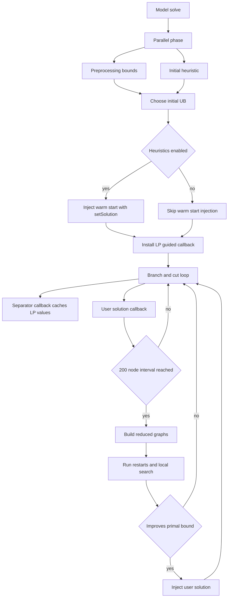

# Primal Heuristic

Files:
- `src/heuristic/primal_heuristic.h`
- Integration points: `src/model/model.cpp`, `src/model/highs_bridge.cpp`

## Purpose

The solver uses two heuristic layers:

1. **Pre-solve initial solution** (`build_initial_solution`): constructs a feasible route and injects it into HiGHS via `setSolution()` (unless heuristics are disabled).
2. **LP-guided callback heuristic** (`lp_guided_heuristic`): runs during MIP search from `kCallbackMipUserSolution`, using LP-driven reduced graphs.

Both optimize the same objective:

\[
\min\; \sum_{e \in E} c_e x_e - \sum_{i \in V} p_i y_i
\]

## How It Is Used In `Model::solve()`

1. Preprocessing and initial heuristic run in parallel.
2. The best known initial UB is selected from:
   - heuristic result
   - optional cutoff
   - optional ng/DSSR elementary path incumbent
3. If `disable_heuristics=false`, initial solution is passed to HiGHS using `setSolution()`.
4. `HiGHSBridge::install_heuristic_callback()` installs LP-guided heuristic callback(s).

## Initial Solution Heuristic

### Construction

- Customer candidates exclude source/target and must satisfy `demand <= Q`.
- Start route:
  - Tour: `[source, source]`
  - s-t path: `[source, target]`
- Mandatory endpoint demands are subtracted from remaining capacity.
- Greedy cheapest insertion is applied over a customer ordering.
- If too short, force-insert best feasible customers to satisfy minimum structure:
  - Tour needs at least 4 nodes in sequence (`[depot, a, b, depot]`)
  - Path needs at least 2 nodes (`[source, target]`)

### Local Search Neighborhoods

Applied with first-improvement up to iteration limit:
- 2-opt
- Or-opt (chain sizes 1, 2, 3)
- Node drop
- Node add

### Deterministic vs Opportunistic

Controlled by solver option `parallel_mode`:

- `parallel_mode=deterministic` (default):
  - fixed restart count `clamp(num_nodes, 20, 200)`
  - fixed seeds for random restarts
  - reproducible across runs
- `parallel_mode=opportunistic`:
  - time-budgeted worker loops with non-deterministic seeds
  - default budget in `Model::solve()` is `min(500ms, max(10ms, n*10ms))`
  - in all-pairs propagation mode, budget uses `max(10ms, n*10ms)`

## LP-Guided Callback Heuristic

### Callback Behavior

Registered in `HiGHSBridge::install_heuristic_callback()`.

- Trigger type: `kCallbackMipUserSolution`
- Skips initial `kExternalMipSolutionQueryOriginAfterSetup`
- Rate-limited to once every 200 B&B nodes
- Reads cached LP values `(x_lp, y_lp)` from separator callback cache
- Optionally uses current incumbent (`data_out->mip_solution`)
- Injects a heuristic solution only if strictly improving primal bound

Additionally:
- Async incumbent candidates (e.g., from ng/DSSR) are injected first when newer and better.
- `kCallbackMipInterrupt` is used to stop solve when bounds close after incumbent acceptance.

### Reduced Graph Strategies

`heuristic_strategy` option:
- `0`: all (default)
- `1`: LP-threshold
- `2`: RINS-style
- `3`: neighborhood expansion

Strategy details:
- **LP-threshold**: keep edges with `x_e > 0.1`, plus edges between active high-`y` nodes (`y_i > 0.5`)
- **RINS-style**: union of incumbent edges (`>0.5`) and fractional LP edges (`>0.1`)
- **Neighborhood**: seed from edges with `x_e > 0.3`, then expand to active-node pairs

Source/target are always active.

## Flow



## Pseudocode

### Initial solution

```text
function BUILD_INITIAL_SOLUTION(prob, num_restarts, time_budget_ms):
    customers <- feasible non-endpoint nodes
    fixed_orders <- [ratio_order, profit_order, source_distance_order]

    if time_budget_ms > 0:
        run parallel workers until deadline:
            choose fixed or shuffled order
            (tour, obj) <- SINGLE_RESTART(prob, customers, order)
            update global best if improved
    else:
        append deterministic shuffled orders (fixed seeds)
        parallel_for each order:
            results[i] <- SINGLE_RESTART(...)
        select best result in deterministic index order

    return TOUR_TO_SOLUTION(best_tour), best_obj
```

```text
function SINGLE_RESTART(prob, customers, order):
    init route as [s,s] for tour or [s,t] for path
    remaining_cap <- Q - mandatory endpoint demands
    greedy_insert(order)
    force_insert until minimum structure reached if possible
    local_search(2-opt, or-opt, drop, add)
    return route and objective if valid else +infinity
```

### LP-guided callback

```text
on kCallbackMipUserSolution:
    if initial_query_after_setup: return
    if async_incumbent newer and better: inject and return
    if node_count - last_node_count < 200: return

    read cached (x_lp, y_lp); if empty return
    incumbent <- current mip solution if available

    result <- lp_guided_heuristic(prob, x_lp, y_lp, incumbent, budget, strategy)
    if result improves primal bound:
        inject result as user solution
```

## Solver Options Affecting Heuristic

| Option | Default | Effect |
|---|---:|---|
| `heuristic_callback` | `true` | Enable LP-guided callback heuristic |
| `heuristic_budget_ms` | `20` | Callback time budget per invocation |
| `heuristic_strategy` | `0` | `0=all, 1=LP-threshold, 2=RINS, 3=neighborhood` |
| `parallel_mode` | `deterministic` | Deterministic (fixed restarts) vs opportunistic mode |
| `disable_heuristics` | `false` | Disable warm-start injection and set HiGHS internal heuristic effort to 0 |

## Testing Status

Current default test targets focus on solver integration (`rcspp_tests`, Python solver tests). Relevant regression coverage includes:
- heuristic-disable path behavior (`tests/test_model.cpp`)
- cutoff/prove-only behavior with heuristics disabled (`tests/test_ubs_cutoff.cpp`)

Direct heuristic unit tests exist in `tests/test_separators.cpp` (`[heuristic]` tags), but they are not part of the default `rcspp_tests` target.
