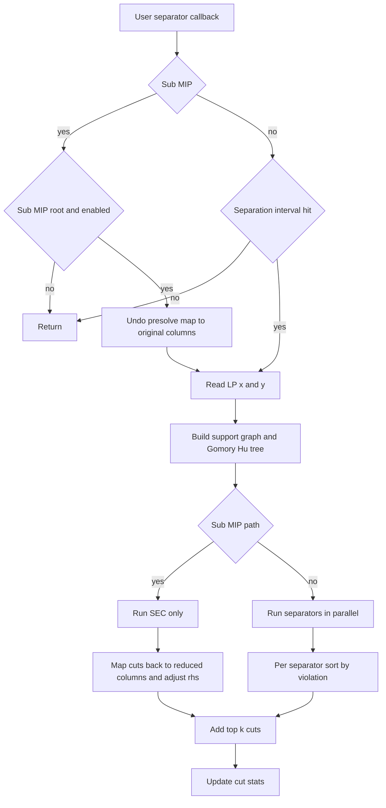

# Cut Separation

File: `src/sep/` directory

## Overview

Five families of cutting planes are separated dynamically. All separators are
**solver-independent** — they implement `rcspp::sep::Separator` and receive a
`SeparationContext` containing the LP relaxation solution, problem data, and a
shared Gomory-Hu tree. The `SeparationOracle` class bundles all separators into
a single call usable from any MIP solver's cut callback.

All cuts use formulations valid for RCSPP with optional vertices (y variables),
originally developed for the CPTP (Jepsen et al. 2014). Standard CVRP cuts are
**invalid** here because they assume all nodes are visited.

## Gomory-Hu Tree

File: `src/core/gomory_hu.h`

Implements **Gusfield's simplified algorithm** to compute all pairwise min-cuts
with only $n-1$ max-flow calls (instead of $O(n^2)$). The tree is built once per
separation round from the fractional support graph and shared across all separators.

Each max-flow uses the **Dinitz algorithm** ($O(V^2 E)$) on the support graph
(`src/core/dinitz.h`).

Two query methods:

- `min_cut(target)` — walks the tree path from target to root (depot), returns
  the bottleneck cut partition and value. Used by SEC, Multistar, RGLM.
- `all_cuts_on_path(target)` — returns all cuts along the path as lightweight
  `CutRef` objects. Gives $O(\text{depth})$ candidate sets per target with zero additional
  max-flow cost. Used by RCI for multi-candidate extraction.

**References**:
- Gusfield, D. (1990). Very simple methods for all pairs network flow analysis. *SIAM J. Comput.*, 19(1), 143-155.
- Dinitz, Y. (1970). Algorithm for solution of a problem of maximum flow in a network with power estimation. *Soviet Math. Doklady*, 11, 1277-1280.

## Subtour Elimination (SEC)

File: `src/sep/sec_separator.cpp`

For each customer $t$ with $y_t > \text{tol}$, query the Gomory-Hu tree min-cut between
depot and $t$. The SEC requires:

$$x(\delta(S)) \ge 2\,y_t$$

where $S$ is the target-side partition (not containing the depot).

For **s-t path** instances (source != target), sets containing the path target
need only 1 cut crossing (the path enters and terminates), so the RHS becomes
$y_t$ instead of $2\,y_t$.

**Sparse form selection**: The separator counts nonzeros in two equivalent forms
and emits whichever is sparser:

| Form | Constraint | Nonzeros |
|---|---|---|
| Cut form | $2\,y_t - x(\delta(S)) \le 0$ | $\lvert\delta(S)\rvert + 1$ |
| Inside form | $x(E(S)) - \sum_{j \in S \setminus \{t\}} y_j \le 0$ | $\lvert E(S)\rvert + \lvert S\rvert - 1$ |

The inside form is derived via degree substitution: $x(\delta(\{i\})) = 2\,y_i$ implies
$x(\delta(S)) = 2\sum_{i \in S} y_i - 2\,x(E(S))$.

SEC is also used as a **feasibility check** on incumbent solutions found by HiGHS
heuristics (feasibility pump, rounding, sub-MIPs). Any integer solution with
a violated SEC is rejected. This uses tight tolerance (1e-6) vs the looser
fractional tolerance (default 0.1).

### Sub-MIP feasibility and separation

HiGHS primal heuristics (RENS, RINS) solve sub-MIPs that inherit our callbacks
but run their own presolve, which remaps columns. Two mechanisms handle this:

1. **Feasibility check with column mapping**: In `addIncumbent()`, sub-MIP
   solutions are expanded from reduced to original column space via
   `postSolveStack.undoPrimal()` before the SEC feasibility check. Without this,
   ~20-42% of sub-MIP incumbents violate SEC and corrupt the upper bound.

2. **Root-node SEC separation**: At the sub-MIP root node (`num_nodes == 0`),
   the LP solution is expanded to original space, SEC separation runs, and
   resulting cuts are translated back to reduced space. An inverse column map
   (`orig_to_reduced`) maps cut indices; eliminated columns have their fixed
   values subtracted from the cut RHS. Only SEC runs in sub-MIPs -- other
   separators are skipped to minimize overhead.

Sub-MIP separation is controlled by `--submip_separation true/false` (default: true).

## Rounded Capacity Inequalities (RCI)

File: `src/sep/rci_separator.cpp`

For a set $S$ of customers with total demand $d(S)$, define:

- $Q_r = d(S) \bmod Q$ (skip if $Q_r = 0$)
- $k = \lceil d(S)/Q \rceil$ (skip if $k \le 1$)

The RCI in $\ge$ form:

$$x(\delta(S)) - \frac{2}{Q_r} \sum_{i \in S} q_i\,y_i \;\ge\; 2\!\left(k - \frac{d(S)}{Q_r}\right)$$

**Inside form** (via degree substitution, chosen when sparser):

$$x(E(S)) - \sum_{i \in S} \!\left(1 - \frac{q_i}{Q_r}\right) y_i \;\le\; \frac{d(S)}{Q_r} - k$$

### Multi-candidate extraction

Unlike SEC which uses one min-cut per target, RCI uses `all_cuts_on_path(target)`
to extract **all** Gomory-Hu tree cuts along each target's path to root. This
yields $O(\text{depth})$ candidate sets per target with no extra max-flow calls. Duplicate
candidates (same GH tree node) are skipped via an `evaluated` bitmap.

### Add/drop local search

Each candidate set is refined by alternating add and drop phases:

1. **Drop phase**: Try removing each node from S; accept the best-improving removal.
   Repeat until no improvement.
2. **Add phase**: Try adding each node adjacent (in the support graph) to S;
   accept the best-improving addition. Repeat until no improvement.
3. Alternate drop/add until no improvement in either phase.

Candidates are evaluated and refined in parallel via TBB.

### Output cap

Results are sorted by violation (descending) and capped at $\max(5, n/5)$ cuts
per separator round (internal cap, before the per-separator top-k limit in
HiGHSBridge).

## Multistar / GLM Inequalities

File: `src/sep/multistar_separator.cpp`

The GLM inequality (Jepsen et al. eq 17) for a set $S$:

$$\sum_{e \in \delta(S)} \!\left(1 - \frac{2\,q_{t(e)}}{Q}\right) x_e \;-\; \frac{2}{Q} \sum_{i \in S} q_i\,y_i \;\ge\; 0$$

where $t(e)$ is the endpoint of crossing edge $e$ that lies **outside** $S$.

In $\le$ form (for the HiGHS cut pool):

$$\frac{2}{Q} \sum_{i \in S} q_i\,y_i \;-\; \sum_{e \in \delta(S)} \!\left(1 - \frac{2\,q_{t(e)}}{Q}\right) x_e \;\le\; 0$$

Uses one Gomory-Hu tree min-cut per target node, same as SEC.

## Rounded GLM (RGLM)

File: `src/sep/rglm_separator.h`, `src/sep/rglm_separator.cpp`

Strengthens GLM (multistar) inequalities using ceiling-based rounding, analogous
to how RCI strengthens the basic capacity inequality. Based on eq (24) of
Jepsen et al. 2014 with $a_i = d_i$, $b = Q$. Enabled via `--enable_rglm true`
(disabled by default).

### Background

The GLM inequality (eq 17) for a set $S$ of customers uses the vehicle capacity $Q$
as the denominator in its coefficients. When the total demand is not a multiple
of $Q$, the required number of vehicles $k = \lceil\alpha/Q\rceil$ leaves a fractional
remainder $r = \alpha \bmod Q$. RGLM exploits this by replacing $Q$ with the smaller
value $r$ in the denominators, producing tighter coefficients.

The paper (p. 85) notes that RGLM is not separated directly -- instead, sets S
found by other separators (multistar, capacity) are tested for RGLM violations.
We follow this approach by reusing the Gomory-Hu tree min-cut sets.

### Inequality

For $S \subseteq N$ (customer nodes, no depot), define:

- $\alpha = \sum_{i \in S} d_i + 2\sum_{j \notin S} d_j$
- $r = \alpha \bmod Q$ (skip if $r = 0$, no rounding benefit)
- $k = \lceil\alpha/Q\rceil$ (skip if $k \le 1$)

The RGLM constraint in $\ge$ form:

$$\sum_{e \in \delta(S)} x_e \;\ge\; 2k - \frac{2\,\beta}{r}$$

where $\beta = \sum_{i \in S} d_i(1-y_i) + \sum_{j \notin S} d_j\!\left(2 - \sum_{e \in E(j,S)} x_e\right)$.

Rearranging to $\le$ form for the cut pool:

$$\frac{2}{r} \sum_{i \in S} d_i\,y_i \;+\; \sum_{e \in \delta(S)} \!\left(\frac{2\,d_{\text{out}}(e)}{r} - 1\right) x_e \;\le\; 2\!\left(\frac{\alpha}{r} - k\right)$$

where $d_{\text{out}}(e)$ is the demand of the endpoint of $e$ outside $S$.

### Key difference from GLM

| | GLM | RGLM |
|---|---|---|
| $x$-coefficient | $-(1 - 2\,d_{\text{out}}/Q)$ | $2\,d_{\text{out}}/r - 1$ |
| $y$-coefficient | $2\,d_i/Q$ | $2\,d_i/r$ |
| RHS | $0$ | $2(\alpha/r - k)$ |
| Denominator | $Q$ (capacity) | $r = \alpha \bmod Q$ |

Since $r \le Q$, the RGLM coefficients are at least as strong as GLM whenever
$r > 0$ and $k > 1$.

### Algorithm

Follows the same structure as `MultistarSeparator::separate()`:

1. Precompute $d_{\text{total}} = \sum$ of all customer demands (constant across targets).
2. For each target node (non-depot, $y > \text{tol}$):
   - Get min-cut from Gomory-Hu tree: $S = \{u : \texttt{!reachable}[u]\}$
   - Compute $\alpha = 2\,d_{\text{total}} - d_S$, $r = \alpha \bmod Q$, $k = \lceil\alpha/Q\rceil$
   - Skip if $r \le \text{tol}$ (no rounding benefit) or $k \le 1$
   - Compute $\text{cut\_flow}$ and weighted $\text{star\_sum}$ over crossing edges
   - Check violation: $(2k - 2\,\beta/r) - \text{cut\_flow} > \text{tol}$
   - Emit cut in $\le$ form with appropriate coefficients

### Usage

CLI:
```bash
./build/rcspp-solve instance.sppcc --enable_rglm true
```

### Benchmark

Tested on 24 A/B/E SPPRCLIB instances (60s time limit):

| Metric | Value |
|---|---|
| Geo-mean speedup (ON vs OFF) | 1.03x |
| Wins ON / OFF / Tie | 10 / 8 / 6 |
| Best speedup | B-n57-k7-20 1.86x, B-n45-k6-54 1.46x |
| Worst slowdown | B-n52-k7-15 0.57x, A-n54-k7-149 0.71x |

Performance is neutral on aggregate. Helps on some B-class instances where the
rounding remainder is significant relative to capacity, but adds overhead on
instances where GLM cuts are already sufficient.

Disabled by default pending further tuning (e.g., filtering by violation
magnitude, limiting to sets with large r/Q ratio).

## Comb Inequalities

File: `src/sep/comb_separator.cpp`

Implements a BFS-based heuristic for comb separation (Jepsen et al. eq 13):

1. **Handle construction**: BFS from depot, adding nodes with $x_e > \text{threshold}$
   (tries thresholds 0.5 and 0.3).
2. **Tooth identification**: Crossing edges (one endpoint in handle, one outside)
   become candidate teeth. Each tooth contributes $x_e - y_{\text{outside}}$.
3. **Greedy selection**: Sort teeth by contribution, greedily select with no
   shared inside/outside nodes. Require $\ge 3$ teeth, odd count.
4. **Violation check**: $x(E(H)) + \sum x_{\text{tooth}} - \sum_{j \in H} y_j - \sum y_{\text{outside}} > (t-1)/2$.

**Status**: Currently active but produces very few cuts in practice. The
formulation requires y-variable corrections not present in the standard CVRP
comb form.

## Shortest Path Inequalities (SPI)

File: `src/sep/spi_separator.h`, `src/sep/spi_separator.cpp`

Derives cutting planes from the all-pairs shortest path lower bounds and the
incumbent upper bound (UB). If the cheapest tour/path visiting every node in a
set S has objective greater than UB, then at most |S|-1 of those nodes can be
selected:

```
Σ_{i ∈ S} y_i ≤ |S| - 1
```

This is the RCSPP analogue of a knapsack cover inequality, where infeasibility
comes from routing cost rather than demand.

Enabled via `--all_pairs_propagation true` (disabled by default). Requires the
all-pairs shortest path matrix, computed once during preprocessing.

### Lower bound computation

For a set S = {v₁, ..., v_k} of customer nodes, the lower bound on any
tour/path visiting all of S is:

```
lb(S) = min_π [ d(s, π₁) + d(π₁, π₂) + ... + d(π_k, t) ] + correction + Σ profit(v)
```

where d(u,v) is the all-pairs shortest path cost from u to v (including
intermediate profits), and the correction term accounts for junction-node
profit double-counting:

- **Tour** (source = target): correction = profit(depot)
- **Path** (source ≠ target): correction = 0

The minimization over permutations is computed exactly via **Held-Karp DP**
in O(2^k · k²) time and O(2^k · k) space, limited to k ≤ 15 nodes
(~3.7 MB working memory).

### Separation algorithm

Three phases:

**Phase 1 — Pair enumeration.** For each pair of candidate nodes (i,j) with
y_i + y_j > 1, compute lb({i,j}). If lb > UB, emit the pair cut. Candidates
are sorted by y-value descending to focus on nodes the LP most wants to select.

**Phase 2 — Greedy grow + shrink.** Starting from infeasible pairs (up to 50
seeds, sorted by violation):

1. **Grow**: Greedily add high-y candidates that maintain lb > UB. Stops at
   k = 15 nodes.
2. **Shrink**: Remove nodes one at a time, preferring removals that keep lb
   highest above UB and have lowest y-value (maximizing violation). Stops at
   size 3 (pairs already emitted in Phase 1).

This finds minimal infeasible sets — removing any member makes the set feasible.
Minimality gives the strongest cut: violation = Σy_v - (|S|-1), and removing
any fractional node increases violation by (1-y_v) > 0.

**Phase 3 — Extended cover lifting.** For each minimal infeasible set S, scan
all nodes j ∉ S. Node j gets coefficient 1 in the cut if *replacing* every
i ∈ S with j still yields lb > UB. This is the extended cover inequality: any
node "at least as expensive" as every member of S can be added without changing
the RHS.

The lifted cut:
```
Σ_{i ∈ S} y_i + Σ_{j lifted} y_j ≤ |S| - 1
```

Lifting requires |S| calls to `compute_set_lb` per candidate node (one per
swap), using the existing all-pairs matrix. No additional labeling is needed.

### Complexity

| Phase | Cost |
|---|---|
| Pair enumeration | O(c² · k²) where c = candidates, k = 2 |
| Grow + shrink | O(seeds · candidates · 2^k · k²) |
| Lifting | O(n · \|S\| · 2^{\|S\|} · \|S\|²) per cut |

All phases index into the precomputed all-pairs matrix — no labeling calls
during separation.

### Usage

CLI:
```bash
./build/rcspp-solve instance.sppcc --all_pairs_propagation true
```

### Testing

7 direct C++ tests under the `[spi]` tag in `tests/test_separators.cpp`:

| Test | Coverage |
|---|---|
| Pair cuts on tour | Infeasible pairs detected with tight UB |
| Lifted pair cuts | Extended cover adds nodes beyond minimal set |
| No cuts (loose UB) | Graceful empty return |
| No cuts (missing data) | Graceful fallback without all-pairs matrix |
| Path problem pairs | Correct profit correction for s-t path |
| Greedy extension | Grow finds set cuts of size ≥ 3 |
| Shrink minimality | Shrink phase finds smallest infeasible subsets |

These direct separator tests are not part of the default `rcspp_tests` target.

### Benchmark

Tested on 20 SPPRCLIB instances, comparing `--all_pairs_propagation true`
(SPI ON) vs baseline (SPI OFF).

**60s time limit** (20 instances):

| Metric | Value |
|---|---|
| Wins ON / OFF / Tie | 2 / 0 / 18 |

- **A-n60-k9-57**: Gap 37.6% → 24.7%. Better objective (-1000 vs -724) and
  tighter bound.
- **E-n101-k14-158**: Gap 5.85% → 5.22%. Better objective (-2539 vs -2127).
- **B-n78-k10-70**: 21% faster (22.1s vs 28.1s) at same optimal.
- Easy instances (<30s): negligible overhead (<1s).

**300s time limit** (5 hardest instances):

| Instance | OFF gap | ON gap | Notes |
|---|---|---|---|
| A-n60-k9-57 | 0% | 0% | Both optimal; OFF 128s, ON 138s |
| A-n80-k10-14 | 0% | 0% | Both optimal; OFF 58s, ON 67s |
| **E-n101-k14-158** | **1.78%** | **0.91%** | **SPI halves the gap** (bound -9965 → -6845) |
| M-n121-k7-260 | ~0% | ~0% | Both near-optimal |
| M-n151-k12-15 | ~0% | ~0% | Both near-optimal |

SPI provides the largest benefit on the hardest unsolved instance (E-n101-k14-158),
nearly halving the remaining gap by tightening the bound while exploring 22% more
nodes (8929 vs 7331). On instances that solve to optimality, SPI adds ~10-15%
preprocessing overhead but does not change the outcome.

Sweep script: `benchmarks/experiment_spi.sh [time_limit]`

## SeparationOracle (solver-independent)

File: `src/sep/separation_oracle.h`, `src/sep/separation_oracle.cpp`

The `SeparationOracle` class provides a solver-independent interface to all
separators. It handles support graph construction, Gomory-Hu tree computation,
and parallel separator execution — everything needed to generate cuts from an
LP relaxation solution.

### Usage

```cpp
#include "sep/separation_oracle.h"

rcspp::sep::SeparationOracle oracle(prob);
oracle.add_default_separators();  // Tour: SEC+RCI+Multistar+Comb, Path: SEC

// In your solver's cut callback:
auto cuts = oracle.separate(x_values, y_values, x_offset, y_offset);
```

### Pipeline (per `separate()` call)

1. Build fractional support graph from edge LP values
2. Build Gomory-Hu tree (n-1 max-flow calls via Dinitz)
3. Build `SeparationContext` (LP values, problem, GH tree, offsets)
4. Run all registered separators **in parallel** (TBB task group)
5. For each separator: sort cuts by violation (descending), keep top-k
6. Merge and sort all cuts by violation

### Feasibility check

`oracle.is_feasible(x, y, x_off, y_off)` creates a temporary SEC separator
with tight tolerance (1e-6) and checks for violated subtour elimination
constraints. Used as a lazy-constraint callback on integer-feasible solutions.

### Parameters

| Method | Default | Description |
|---|---|---|
| `set_max_cuts_per_separator(k)` | 3 | Top-k most-violated cuts per separator per round (0 = unlimited) |
| `separate(..., tol)` | 0.1 | Violation tolerance for cut separation |

### Adding separators

Default set via `add_default_separators()`:

- **Tour** (`source == target`): SEC, RCI, Multistar, Comb
- **Path** (`source != target`): SEC

Individual separators:
```cpp
oracle.add_separator(std::make_unique<rcspp::sep::SECSeparator>());
oracle.add_separator(std::make_unique<rcspp::sep::RCISeparator>());
oracle.add_separator(std::make_unique<rcspp::sep::MultistarSeparator>());
oracle.add_separator(std::make_unique<rcspp::sep::CombSeparator>());
oracle.add_separator(std::make_unique<rcspp::sep::RGLMSeparator>());
```

### Cut format

Each `Cut` returned by `separate()`:

| Field | Type | Description |
|---|---|---|
| `indices` | `vector<int32_t>` | Column indices in the LP |
| `values` | `vector<double>` | Coefficients |
| `rhs` | `double` | Right-hand side (<= form) |
| `violation` | `double` | Violation amount |

### Testing

The SeparationOracle and individual separators are covered by direct C++
separator tests in `tests/test_oracle.cpp` and `tests/test_separators.cpp`
(`oracle`, `sec`, `rci`, `multistar`, `comb`, `rglm`, `spi`, `separator`
tags).

| Component | Coverage |
|---|---|
| SeparationOracle | Tour/path cuts, feasibility, offsets, limits, no-separator edge case, cut struct validation |
| SEC separator | Violated/feasible (tour + path), target-in-S rhs handling, multi-disconnected |
| RCI separator | Basic + high-demand fractional solution |
| Multistar | Basic execution |
| Comb | Basic execution |
| RGLM | Basic execution |
| SPI | Pairs, lifting, loose UB, missing data, path, grow, shrink |

Direct separator tests are currently outside the default `rcspp_tests` target.

## Cut Management (HiGHS)

Managed by `HiGHSBridge::install_separators()` (`src/model/highs_bridge.cpp`).
The HiGHS integration uses `SeparationOracle` internally for feasibility checking
and wraps the same separation pipeline for HiGHS's user separator callback.

### Per-round pipeline

1. Build fractional support graph from LP relaxation
2. Build Gomory-Hu tree (shared, n-1 max-flows)
3. Build `SeparationContext` (LP values, offsets, tolerance, UB, optional all-pairs matrix)
4. Main MIP: run configured separators **in parallel** (TBB task group)
5. Sub-MIP root: run SEC only, translate original indices back to reduced space
6. For each separator: sort cuts by violation (descending), keep top-k

Current separator registration in `Model::solve()`:
- Always: SEC
- Tour mode only: RCI, Multistar, optional RGLM, Comb
- Optional when `all_pairs_propagation=true`: SPI

### Flow



### Pseudocode

```text
on user_separator_callback(lp_solution, mipsolver):
    if submip:
        if not submip_separation or not root_node: return
        expand reduced columns to original columns
        build orig_to_reduced map
    else:
        if interval_skip: return
        cache LP x/y for heuristic callback

    build support graph from x > graph_tol
    build Gomory-Hu tree
    build SeparationContext(tol, offsets, upper_bound, all_pairs?)

    if submip:
        cuts <- SEC.separate(ctx)
        for cut in top_k(cuts):
            translate indices to reduced space
            shift rhs for eliminated columns
            add cut
    else:
        run each configured separator in parallel
        for each separator:
            sort cuts by violation
            add top_k cuts
            update per-separator timing and counts
```

### Parameters

| Parameter | CLI flag | Default | Description |
|---|---|---|---|
| max_cuts_per_sep | `--max_cuts_per_separator N` | 3 | Top-k most-violated cuts per separator per round |
| separation_tol | `--separation_tol X` | 0.1 | Fractional violation threshold |
| separation_interval | `--separation_interval N` | 1 | Run separation every N-th callback (amortization) |
| enable_rglm | `--enable_rglm true` | false | Enable RGLM separator |
| all_pairs_propagation | `--all_pairs_propagation true` | false | Enable SPI separator + all-pairs domain propagation |
| submip_separation | `--submip_separation true` | true | SEC separation at sub-MIP root node |

### Tolerances

Two separate tolerances:

- **Fractional** (frac_tol_, default 0.1): Used during LP separation. Higher
  threshold avoids weak cuts that slow the LP. Jepsen et al. (2008) found 0.4
  optimal with CPLEX; HiGHS needs lower since it has fewer built-in cuts.
- **Integral** (int_tol_, 1e-6): Used for feasibility checking of incumbent
  solutions. Tight to avoid rejecting valid solutions due to float noise.

## References

- Jepsen, M., Petersen, B., Spoorendonk, S., & Pisinger, D. (2014). A branch-and-cut algorithm for the capacitated profitable tour problem. *Discrete Optimization*, 14, 78-96.
- Jepsen, M., Petersen, B., Spoorendonk, S., & Pisinger, D. (2008). Subset-row inequalities applied to the vehicle-routing problem with time windows. *Operations Research*, 56(2), 497-511.
